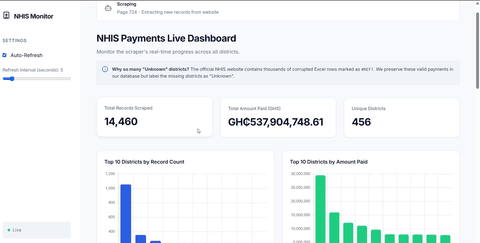

# NHIS Payments Tracker v2

A robust, full-stack data pipeline and visualization dashboard designed to extract, clean, and visualize National Health Insurance Scheme (NHIS) payments across districts in Ghana.

## ?? Live Demo

Check out the live scraping and dashboard rendering in action:

## ??? Architecture

This project is built with resilience and scalability in mind, separated into three distinct microservices.

### 1. Selenium Scraper (/scraper)
The extraction engine that pulls raw data from the official NHIS portal.
- **Language:** Python
- **Framework:** Selenium WebDriver with webdriver-manager
- **Key Features:**
  - **Telerik API Fast-Forwarding:** Utilizes injected JavaScript to manipulate the ASP.NET RadGrid controls, allowing the scraper to instantly jump hundreds of pages (e.g., directly to page 1014) instead of manually clicking "Next" hundreds of times.
  - **Auto-Deduplication:** Aggressively runs a Pandas drop_duplicates() sweep on the entire CSV database every time a single page is saved. This mathematically guarantees 100% data integrity even if the scraper repeats a page due to server timeouts.
  - **Resilience Engineering:** Built-in retry mechanisms and staleness checks to survive severe server-side rate limiting, AJAX timeouts, and Cloudflare overlays.
  - **Fail-Safe Checkpoints:** Saves progress to 
his_checkpoint_v2.txt. If a fast-forward jump is intercepted by the server, it instantly raises a fatal exception to abort the process rather than silently overwriting the checkpoint and corrupting the database.
  - **Data Sanitization:** Dynamically detects and cleans corrupted #REF! district rows inserted by the source ASP.NET table, labeling them as "Unknown" without losing the payment data.

### 2. Backend REST API (/webapp/backend)
The data-serving layer that bridges the raw CSV database to the frontend.
- **Language:** Python
- **Framework:** FastAPI & Pandas
- **Key Features:**
  - **In-Memory Analytics:** Uses Pandas dataframe operations for blazing-fast metric aggregations, sorting, and pagination across tens of thousands of records.
  - **Secure Tunneling:** Exposed via a cloudflared tunnel, bypassing local NAT and firewall restrictions to serve the API securely to the public internet.
  - **CSV Streaming:** Streams large CSV exports directly from memory to the client.

### 3. Frontend Dashboard (/webapp/frontend)
The presentation layer hosted on Vercel.
- **Language:** HTML / CSS / Vanilla JavaScript
- **Frameworks:** Chart.js
- **Key Features:**
  - **Live Auto-Refresh:** Automatically polls the backend API every 5 seconds to provide a real-time view of the scraper's progress.
  - **Responsive Design:** Modern, flat-design UI using CSS Grid and Flexbox layouts.
  - **SEO Optimized:** Fully configured Open Graph SEO tags for rich WhatsApp and Twitter link unfurling.

## ??? Setup & Local Development

### Requirements
- Python 3.10+
- Node.js (for Vercel CLI)
- Google Chrome & ChromeDriver

### 1. Running the Scraper
`ash
cd scraper
python main.py
`
This will launch the scraper in headless mode, generate 
his_payments_v2.csv, and track progress in 
his_checkpoint_v2.txt.

### 2. Running the API
`ash
cd webapp/backend
pip install fastapi uvicorn pandas
python main.py
`
This exposes the API locally at http://127.0.0.1:8000.

### 3. Exposing the API publicly (Cloudflare Tunnel)
`ash
cd webapp/backend
cloudflared tunnel --url http://127.0.0.1:8000
`
*Note: Update webapp/frontend/main.js with the new generated Cloudflare URL.*

### 4. Running the Frontend
`ash
cd webapp/frontend
npx vercel --prod
`

## ?? Future Enhancements
- Dockerize the entire stack for simple one-click deployment.
- Integrate PostgreSQL to replace the in-memory Pandas dataframe for long-term data persistence.
- Add cron jobs to fully automate the scraper schedule on a VPS.

## ????? Author
**Jephthah Kwame Lanor**
- GitHub: [@Lanor-Jephthah1](https://github.com/Lanor-Jephthah1)
- Twitter: [@jeff_lanor](https://twitter.com/jeff_lanor)

## ?? License
This project is open-source and available under the [MIT License](LICENSE).
